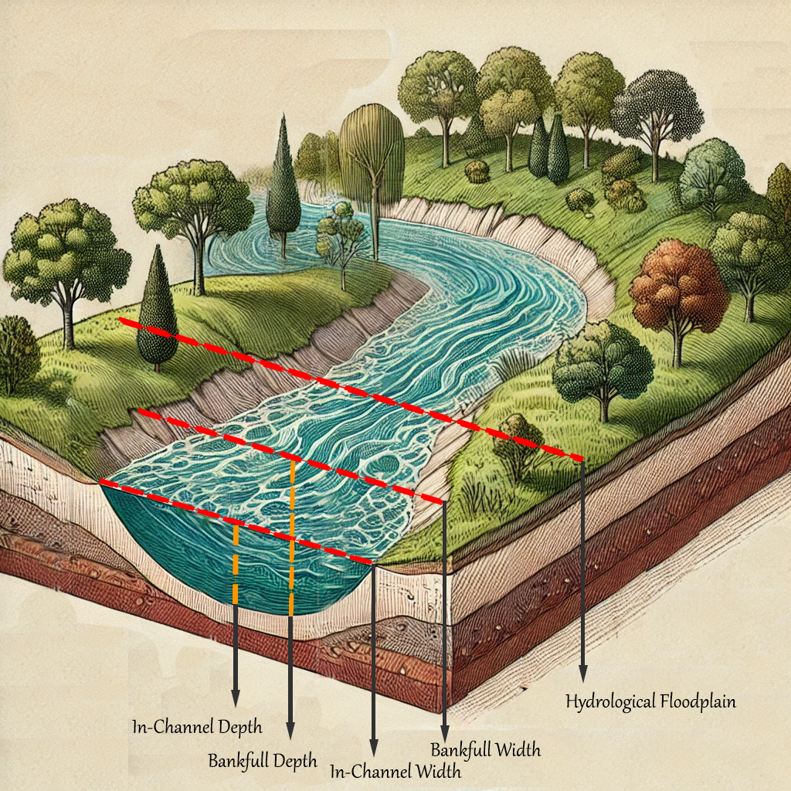
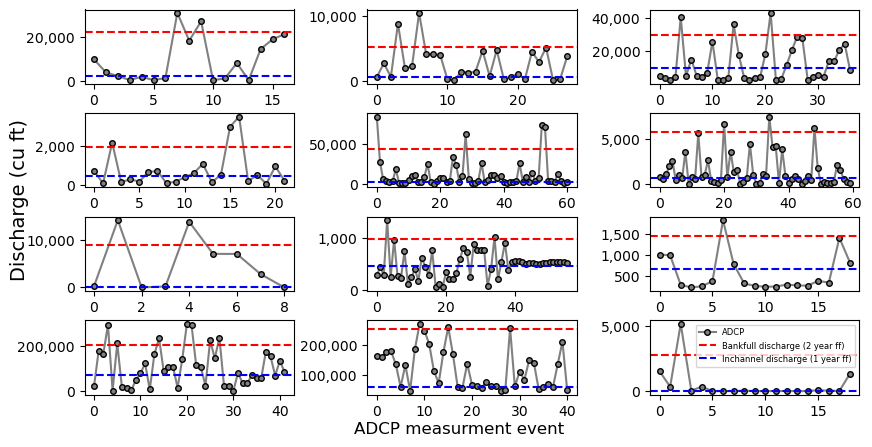

# RiverShapeML


## **All machine learning models developed in this project are shared in the NOAA-OWP HydrofabricML repository, contributing to the Enterprise Hydrofabric Solution.**

A machine learning approach for estimation of bankfull width and depth 

- [Repo](#Repository)
  * [Cloning](#Cloning)
  * [Training](#Training)
  * [Deployment](#Deployment)
- [Overview](#Overview)
- [Input data](#Input-data)
  * [Preprocessing](#Preprocess-data)
  * [Discharge] (#Approximation-of-bankfull-and-inchannel-discharge) 


## Repository

### Cloning

```shell
git clone https://github.com/lynker-spatial/RiverShapeML.git
```

### Training

> One can train the model using following command:

```shell
./run_ml.bash -c my_model -n -1 -x False -y False -r 0.6 -t 5
```
where 

-c: custom model run name

-n: number of cores to be used

-x: whether to transform input variables

-y: whether to transform input variables

-r: coefficient of determination threshold to remove stations below it

-t: threshold for the least number of observations to have in the station
...

### Deployment

> To deploy the ML model 

```shell
cd deployment
bash conda_setup.bash -n -1 
```
Where:  

**-n** is the number of cores to be used in parallel. An integer depends on the number of cores. Use -1 for utilizing all


## Overview

Here we use the USGS “HYDRoacoustic dataset in support of the Surface Water Oceanographic Topography satellite” mission (HYDRoSWOT) to:

1. Build an ML model that uses climate, land surface, subsurface and topological attributes aggregated over divide and incremental catchements to predict **channel depth and width at bankfull** 



2. Build an ML model that uses climate, land surface, subsurface and topological attributes aggregated over divide and incremental catchements to predict **channel depth and width at inchannel**. This is often the part that is not captured by the DEM or sattelite imagery due to presence of water at all times.

## Input data
The ML model establishes a relation between different attributes that are agrregated at catchment and local area and the FHG coefiencets namely a, b, c, f, k, and m. These include

 1- The reference fabric data 
 - streamorde --> Modified Strahler stream order
 - arbolatesu --> Arbolate sum, the sum of the lengths of all digitized flowlines upstream from the downstream end of the immediate flowline, in kilometers
 - roughness --> Manning's roughness
 - etc.

 2- Soil data
 - clay_mean_0_5 --> % clay 
 - ksat_mean_0_5 --> the effective saturated hydraulic conductivity, (cm hr-1) 
 - theta_s_mean_0_5 --> the saturated soil water content, (cm3 cm-3) 
 - etc.

3- From DEM
- elevation --> elevation (m) 
- slope --> slope 
- US NED Physiographic Diversity
- etc.

4- The StreamCat dataset
- Base flow index
- NLCD
- Road density
- etc.

5- Land surface features
- Leaf area index
- Soil moisture 
- NDVI
- etc.

6- Climate data
- Precipitation 
- Evaporation
- Temperature
- etc.  

7- NWM simulations
- NWM 2.1 quartiles
- NWM 2.1 flood frequnecies


### Preprocess data
- you can filter the dat using following command:
- it will ask for a year date as the lower bound for filttering ADCP data

```shell
python3 ./preprocess/filter_adcp.py
```

### Approximation of bankfull and inchannel discharge

To get an estimate of discharges associated with to bankfull and inchannel conditions we calculate flood frequencies using an algorithem consitent with literature and the flow data is exracted from two USGS query systems. The outputs are is shown below that plots etimated bankfull and inchannel discharge and comapres it to ADCP recorded discharge values:

```shell
python3 ./flood_frequency/ff.py
```


